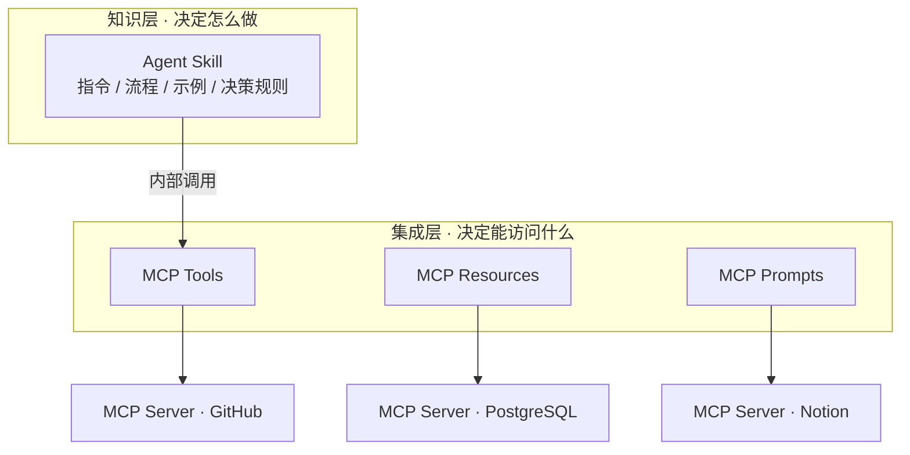

# 通用无场景问题

## 1. Skill 和 MCP 有什么区别

**一句话定位**

> MCP 解决「连接」问题——让 Agent 能访问外部世界；Skill 解决「方法论」问题——教 Agent 怎么做某类任务。
> Anthropic 官方原话："MCP connects Claude to external services and data sources. Skills provide procedural knowledge—instructions for how to complete specific tasks or workflows."

**类比**：MCP 是 AI 的「手 / USB 接口」（能触达数据库、API、外部系统）；Skill 是 AI 的「技能书 / 训练手册」（知道一件事按什么流程、什么标准做）。

**核心对比表**

| 维度 | Skill（Agent Skill） | MCP（Model Context Protocol） |
|---|---|---|
| 本质 | 程序性知识 / 指令包 | 工具连接协议 |
| 解决的问题 | "怎么做好一件事"——上下文管理与能力封装 | "如何访问外部"——Agent 与外部工具/数据源的互操作 |
| 所在层级 | **提示/知识层**（Prompt/Knowledge Layer） | **集成层**（Integration Layer） |
| 形态 | 一个目录：SKILL.md + scripts/ + references/ + assets/ | Client-Host-Server 架构，基于 JSON-RPC 2.0 |
| 核心内容 | 指令、流程、示例、决策规则 | Tools（模型控制）、Resources（应用控制）、Prompts（用户控制） |
| 加载方式 | **渐进式加载**：元数据(~100 token) → 正文(<5k token) → 支持文件按需 | 连接后工具定义常驻上下文，随会话加载 |
| 是否执行代码 | 本身不执行，指导 Agent 执行；可附带脚本 | Server 是真实进程，执行真实操作（查库、调 API、发消息） |
| 部署方式 | 本地文件 / Git 仓库，一条命令安装 | 本地进程（stdio）或远程服务（HTTP/SSE） |
| 复杂度 | 低（以写文档为主，改 markdown 即改行为） | 中高（写代码、起服务、维护连接） |
| 上下文开销 | 低，可同时挂几十个 skill 不膨胀 | 高，每个 server 的工具定义都占 token |
| 典型场景 | 代码规范、品牌规范、SOP 工作流、专家角色 | 查数据库、接 Slack/Notion/GitHub、文件系统、实时数据 |
| 安全风险 | 恶意指令、prompt injection、隐藏脚本 | 权限过宽、凭证泄露、数据外泄 |

**架构层级关系**

**两者是互补关系，不是竞争关系**

Skill 是上层能力封装，MCP 是底层工具接入——**Skill 可以在内部调用 MCP 工具**，并把"什么场景用、参数怎么组织、出错怎么处理"的使用知识一起打包。典型例子：

- **MCP 层**：`agent-mail`（发邮件）、`tencent-docs`（读写腾讯文档）等 connector 提供真实动作能力；
- **Skill 层**：`tencent-docs-routing` 告诉 Agent 遇到 Office 文件该走哪条处理链路，`wb-finance-skill` 告诉 Agent 金融类请求该用哪套方法——它们只是"说明书"，真正执行靠底层工具。

**怎么选？（决策框架）**

| 判断问题 | 答案 | 选择 |
|---|---|---|
| 本质是"知识/流程"还是"能力/访问"？ | 知识/流程 → **Skill**；能力/访问 → **MCP** | — |
| 需要连接第三方 API、数据库、实时数据？ | 是 → MCP | — |
| 只是要固定输出格式 / 遵循某套规范？ | 是 → Skill（纯提示词工程即可） | — |
| Agent 缺的是"不会做"还是"够不着"？ | 不会做 → Skill；够不着 → MCP | — |

**面试加分点（易被追问的坑）**

1. **渐进式信息公开（Progressive Disclosure）是 Skill 的精髓**：几十个 skill 同时存在，但同一时间只加载一两个，上下文效率远高于把工具定义全量塞进上下文——这是 Skill 相对 MCP 的关键优势。
2. **MCP 不是没有代价**：工具定义吃 token（社区观察到"server 暴露过多工具把上下文窗口占满导致幻觉"）、server 需要维护、第三方 server 有安全风险。
3. **判断口诀**："If you're explaining how to do something, that's a skill. If you need Claude to access something, that's MCP."（在教它怎么做 → Skill；要让它访问什么 → MCP）

## 2. 有没有实际写过 Skill？你会怎么定义一个 Skill，以及怎么判断它到底有没有效果？

**先解决"有没有写过"这个立场问题**

面试官问这个，核心不是听你说"写过/没写过"，而是考察三点：**① 对 Skill 触发/加载/结构机制的理解；② 有没有"把经验固化成可复用资产"的方法论；③ 有没有闭环评估意识**（定义了 ≠ 有效，怎么验证）。

两种立场都可以答得好：

- **真写过**：讲真实场景 → 为什么建 → 结构怎么设计 → 上线怎么验证 → 迭代了哪些点；
- **没写过（或接触不多）**：坦诚 + 展示方法论。例如："我在 WorkBuddy / Claude Code 中深度使用过几十个现成 Skill，拆解过它们的源码结构（frontmatter、渐进式加载、目录组织），也按官方 skill-creator 流程实操过从 0 到 1 的完整创建，下面是我的方法。"

**定义一个 Skill 的完整流程（6 步）**

| 步骤 | 关键动作 | 要点 |
|---|---|---|
| 1. 识别场景 | 找出"重复出现、流程固定、容易犯错"的任务，收集 3–5 个真实示例 | 触发条件必须清晰；先问清楚"什么请求应该触发它、什么不该触发" |
| 2. 规划内容 | 分析示例决定放什么：指令 / scripts（确定性操作）/ references（大文档）/ assets（模板） | 原则：**SKILL.md 保持精简，细节下沉到 references**，避免信息重复 |
| 3. 初始化骨架 | 用官方脚手架生成 skill 目录 + SKILL.md 模板 | frontmatter 必须有 `name` + `description`（这是触发判断的唯一依据） |
| 4. 撰写 SKILL.md | 用**祈使句**写指令，回答三问：目的是什么 / 何时用 / 怎么用；写清决策优先级和边界 | 好的 description 等于这个 Skill 成功了一半 |
| 5. 打包校验 | 用打包脚本自动校验 frontmatter 格式、命名规范、结构、引用完整性 | 校验失败会报错，先修再发，避免坏包 |
| 6. 迭代 | 拿真实任务跑，记录失败点 → 更新 SKILL.md → 再测 | Skill 是活的，不是一次成型 |

**怎么写好 SKILL.md（关键细节）**

- **frontmatter 决定触发**：description 用第三人称、写清触发场景。差的描述："做报告"；好的描述："当用户需要把原始数据整理成符合 XX 公司风格的分析报告，包含执行摘要、关键发现和建议时使用"。
- **正文用祈使句**："To accomplish X, do Y"，不用第二人称——让另一个 Agent 实例能直接照做。
- **写死决策优先级**：把冲突时的处理顺序显式列出（如"保留真景优先 → 简化细节 → 再加装饰"），避免 Agent 自由发挥。
- **渐进式公开**：正文控制在 5k token 以内，大资料放 `references/` 按需 grep 加载；同代码反复重写的操作固化成 `scripts/`。

**怎么判断 Skill 到底有没有效果？（评估体系）**

| 层面 | 方法 | 具体指标 |
|---|---|---|
| 客观 | 建立**固定测试集**（5–10 个代表性任务） | 任务完成率、首轮成功率、按验收清单逐项打分 |
| 对比 | A/B 测试：同一任务有/无 Skill 各跑一轮 | 成功率提升幅度、出错次数、人工修正量 |
| 成本 | 上下文消耗对比 | 同任务下 token 消耗、调试耗时是否下降 |
| 用户 | 真实使用反馈 | 是否还在主动用；误触发率 / 漏触发率 |
| 维护 | 迭代稳定性 | 改完后是否引入回归；文档与实现是否一致 |

**核心判断标准（一句话）**：装上 Skill 后，同样的任务是否"**更少解释、更少返工、更稳定地一次做对**"。如果答案是否定的，要么是 description 写得差（触发不准），要么是内容没有提供模型本来不知道的信息——那就该改，而不是删。

**面试加分点**

1. 点出"Skill 是**上下文工程（Context Engineering）**的实践"——装几十个 skill 但上下文不膨胀，靠的就是渐进式公开。
2. 强调"效果要用**测试集度量**，而不是靠感觉"——体现工程化闭环思维。
3. 讲一个真实踩坑故事最加分，例如："最初 description 写得太含糊，Agent 频繁误触发；改成明确的正向+负向触发条件后，误触发率大幅下降，测试集首轮成功率从 60% 提到 90%。"
