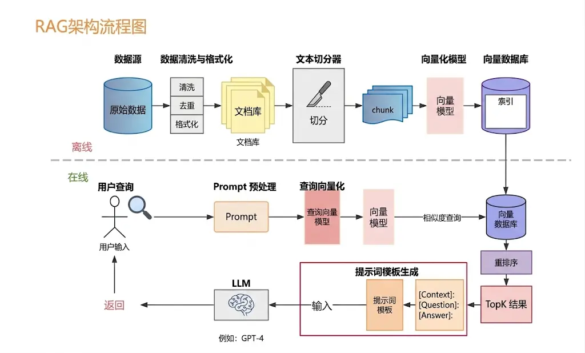
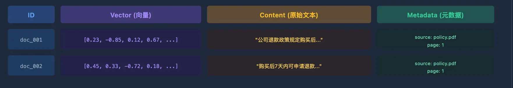

### 一. 基础点

#### 1. 一个例子说明 ReACT 的的经典具体实现

**用户问**: 2026年苹果和谷歌的市值谁更高, 差多少?

要想要使得这个问题的解决靠Agent的ReAct推理模式, 需要在两个方面下功夫

1. 发给LLM的初始prompt
2. 构建Agent的代码要遵循ReAct编排

Prompt需要用来约束LLM的思考强度(不要一次性多步思考)和输出格式:

```markdown
你是一个 AI 助手，可以使用以下工具：
- search(query): 搜索互联网获取最新信息
- calculator(expr): 计算数学表达式

回答时请严格按照以下格式：
Thought: 你的思考过程（分析当前情况，决定下一步）
Action: 工具名称
Action Input: 工具的输入参数
Observation: （此行由系统填入工具返回的结果，你不用写）
... 以上可以重复多轮 ...
Final Answer: 当你确定可以回答时，在这里给出最终答案

问题：2024 年苹果公司的市值是多少？和谷歌相比谁更高？
```

代码要跑一个循环, 不断的 "调LLM, 检查输出, 执行工具, 填回结果":

```python
def react_agent(question: str, tools: dict, max_steps: int = 10):
    # 把 ReAct 格式约束和问题拼在一起，作为初始 prompt
    prompt = build_react_prompt(question, tools)
    # 用来存每一轮的对话历史，每次调 LLM 都把完整历史带上
    history = []

    for _ in range(max_steps):
        # 调 LLM，让它输出下一步的 Thought + Action
        # 注意：每次调用都把完整历史拼进去，LLM 才知道之前做了什么
        response = llm.generate(prompt + "\n".join(history))

        if "Final Answer:" in response:
            # LLM 输出了 Final Answer，说明它判断任务完成了
            return response.split("Final Answer:")[-1].strip()

        # 从 LLM 输出里解析出 Action 名称和 Action Input
        # 例如：Action: search，Action Input: 苹果公司市值 -> ("search", "苹果公司市值")
        action, action_input = parse_action(response)

        # 执行对应的工具，拿到真实结果
        if action in tools:
            observation = tools[action](action_input)
        else:
            # 如果 LLM 填了一个不存在的工具名，给它一个错误反馈
            observation = f"工具 {action} 不存在，请选择可用工具"

        # 把这一轮的 LLM 输出（含 Thought+Action）和 Observation 都追加进历史
        # 下次调 LLM 时这些内容会成为它的「记忆」
        history.append(response)
        history.append(f"Observation: {observation}")

    return "超过最大步数，任务未完成"
```

现代 LLM（GPT-4、Claude 3 之后）基本都原生支持 Function Calling / Tool Use，模型可以直接输出结构化的 JSON 工具调用，不再需要靠解析 `Action: xxx `这种文本格式。

#### 2. RAG 的整体工作流程

一个完整的RAG系统分为两个大阶段

1. **索引阶段 (离线)**

   开卷考试前把每本书贴上标签, 目录索引, 标注重点内容

2. **查询阶段 (在线)**

   考试时, 哪道题目, 先理解题目, 然后在参考书中快速找到相关章节, 基于内容组织答案



#### 3. 向量数据库 vs 关系型数据库 vs Key-value数据库

#### 4. Single-Agent v.s. Multi-Agent

Single-Agent 适合**任务流程清晰, 复杂度适中的场景, 实现简单, 好维护, 子任务之间边界清晰一点**

Multi-Agent适合需要**专业分工, 任务量大或者需要并行执行的复杂场景**, 多Agent的两种拓扑

- 中心化的Orchestrator模式, 有一个主Agent统一调度各个Worker
- 去中心化的 Peer-to-Peer 模式, Agent之间直接通信

#### 5. 理解 向量数据库

比如在进行照片的存储时

- 传统的关系型数据库(`MySQL`, `PostgreSQL`等)可以帮助**存储照片的元数据**, 比如拍摄时间, 地点, 参数信息等, 这些也是进行照片搜索时的一些依据

但是, 当我们需要**根据照片的内容(颜色, 纹理, 物体等) 进行搜索时**, 传统数据库将无法满足需求, 他们以数据表的形式存储数据, 并使用查询语句进行"精确搜索"....

此时, **向量数据库**就派上了用场:

- 我们可以构建一个**多维的空间**使得**每张照片特征都存在于这个空间内**，并用已有的维度进行表示，比如 时间、地点、相机型号、颜色....此**照片的信息将作为一个点**，存储于其中。以此类推，即可在该空间中 构建出无数的点，而后我们将这些点与空间坐标轴的原点相连接，就成为了一条条向量，当这些点变为 向量之后，即可利用向量的计算进一步获取更多的信息。当要进行照片的检索时，也会变得更容易更快捷。
- 在向量数据库中进行检索时, 检索并不是唯一的精确的, 而是查询和目标向量**最为相似的一些向量**, 具有**模糊性**

向量数据库的应用场景:

- 只要对图片、视频、商品等素材进行向量化，就可以实现以图搜图、视频相关推荐、相似宝 贝推荐等功能。

向量数据库存储结构:



- 可以直观的理解三者关系:
  1. 向量是索引卡(语义索引), 原文是书页内容, metadata是书签
  2. 索引卡能够告诉你这段内容在**语义空间中的位置**
  3. 书页才是LLM真正要阅读的内容, 会被注入prompt发给LLM
  4. 书签记得是来源文件名, 页码, 章节这些附加信息, 可以用于**过滤和溯源**

#### 6. 如何评估和选择 Embedding 模型

主流常见的 Embedding 模型有三类:

1. **OpenAI 的 text-embedding 系列**
2. **BGE 系列 (北京智源研究院出品)**
3. **新一代高性能模型**, `Cohere embed-v4`, `Voyage-3-large`, `Qwen3-Embedding`, .....

##### 如何选择 Embedding 模型?

1. 第一是**中英文比例**：知识库以中文为主，可以选 `bge-large-zh-v1.5` 或者更新的 `Qwen3-Embedding`；中英混合，选 `bge-m3`；纯英文或追求省事，选 `text-embedding-3-small`。
2. 第二是**数据合规要求**：数据不能出境，就必须用可以本地部署的开源模型，BGE 系列和 `Qwen3-Embedding` 都是很好的选择。
3. 第三是**向量维度对存储和检索速度的影响**：维度越高精度越好，但存储空间和检索时间都会增加。百万量级的知识库，1024 维是个合理的平衡点；如果规模很小，1536 维也无所谓。有些新模型（如 `text-embedding-3-small`）支持 Matryoshka 降维，可以灵活调整维度来平衡精度和成本。

#### 7. Vibe Coding vs SSD(规格驱动开发)

**AI 编程范式正从Vibe Coding 向 SSD演进：**

1. **Vibe Coding** : 氛围编程, 开发者用自然语言描述大致想法, 体验感受，直接交给AI全权代码, 人主要看运行效果. **先出代码, 后补思考**

   1. 适合做快速原型, demo, 快速验证创意
   2. 但是Vibe Coding 不确定性大, 且最终项目跑不进生产环境, 代码 review 成本高

2. **SSD**: Spec-Driven Development, 规范/规格驱动开发.  核心哲学：**先定规范，再写代码；规范是唯一事实源，代码是规范的输出产物**。

   把需求、接口、数据模型、边界条件、异常、验收标准写成结构化 spec 文档（一般放在仓库`specs/`目录，与代码一起版本管理），AI 严格依照 spec 去生成代码、单元测试；修改功能**优先改 spec，再更新代码**，而不是直接改代码再口头改需求。

**SDD 标准工作流**

1. **起草 Spec**：人输出业务意图，AI 辅助生成结构化规格文档（功能目标、约束、边界 case、验收条件）；
2. **评审对齐**：团队审核 spec，澄清歧义，锁定契约；
3. **AI 落地实现**：AI 读取 spec，输出代码、测试用例；
4. **校验归档**：测试验证代码是否匹配 spec；变更完成后 spec 随代码一并提交入库。

**SDD 分三个实践层级**

1. **Spec‑first 规范优先**：开发前写 spec，开发完可丢弃；
2. **Spec‑anchored 规范锚定**：spec 作为长期资产，随功能迭代持续更新；
3. **Spec‑as‑source 规范即源码**：spec 是一等公民，修改永远从 spec 发起，代码是可重新生成的产物。

**SDD 带来的价值**

1. 解决大模型的不确定性，把模糊 “感觉” 转化为可校验契约；
2. spec 充当 AI 的 “外部长期记忆”，缓解上下文窗口不足；
3. 支持多人协作，变更可追溯、可审计；
4. 测试用例可基于 spec 自动生成，降低回归风险；
5. 开发者重心从写代码，转向**需求建模、系统设计、定义规格**。

### 二. 题目

#### 请你介绍一下 AI Agent 的记忆机制, 并说明在实际开发中应该如何设计记忆模块?

Agent 需要记忆才能在**多步任务中保持记忆, 跨任务积累知识**

**记忆机制可以分为四个层面(类比人类的记忆系统的记忆分类):**

1. **感知记忆:** 当前输入的原始内容;

2. **短期记忆:** context windows 的对话历史 (`message`列表, 有大小限制)

3. **长期记忆:** 外部数据库(向量数据库, 关系数据库, Key-Value存储), 语义检索召回 

   1. 情节记忆: 存具体的时间经历
   2. 语义记忆: 跨多次经验总结出来的抽象知识
   3. 程序记忆: 做某件事的操作流程

   三种记忆通常会混合使用使得Agent的长期记忆真正好用

4. **实体记忆:** 结构化提取的关键事实, 信息密度高, 查询快

**实际设计记忆模块是, 要解决以下问题**

1. **存什么**

   并不是所有内容都值得写入长期记忆, 存太多反而**引入噪音**, 降低检索精准度

   值得存的内容大致有:

   1. 用户偏好和习惯: 语言风格，技术栈偏好, 工作习惯
   2. 任务执行中关键结论和决策
   3. 外部知识; 产品文档, FAQ, 历史案例

2. **怎么存**

   1. 需要语义检索的, **比如文档知识**, **对话摘要这类非结构化的文本**, 适合存进向量数据库
   2. 结构化的用户偏好和状态字段, 比如语言偏好, 项目配置, 可以用关系数据库或 Key-Value参数, 查询速度快

3. **什么时候取出来用**

   1. 主动检索策略: 

      在任务开始前，用当前任务的描述去检索相关记忆，把结果注入 system prompt 作为背景知识。这样 Agent 一开始就带着「历史记忆」进入任务，不需要用户每次重新交代背景

   2. 被动触发策略

      Agent 在推理过程中，判断当前步骤需要某类特定知识时，主动发起检索。具体做法是把「查记忆」封装成一个 Tool，让 Agent 自己决定什么时候调。这种方式更灵活，但依赖模型判断什么时候该去查。

   实践下来, session开始是做一次主动检索, 获得用户偏好和背景的记忆, 任务执行中遇到需要专业知识或者历史数据的步骤 再让Agent按需检索

要根据信息类型选择合适的存储方式, 再搭配 *主动检索和按需检索* 两种策略使用

#### Agent 记忆压缩通常有哪些方法 ?

通常有四种:

1. 滑动窗口: 只保留最近N轮对话
2. 摘要压缩: 长对话总结成简短摘要
3. 重要性过滤: 打分筛选, 只保留重要内容
4. 结构化抽取: 把关键信息抽成结构化的数据存起来

#### 在工程实践中，为什么有时候选择「手搓」Agent，而不是直接用成熟框架？

##### **使用框架构建Agent的痛点**

1. 抽象层太多, 调试的时候不知道哪步出了问题, 排查难
2. 框架的通用设计往往和具体业务需求有偏差, 定制起来反而更费劲
3. 版本升级经常有破坏性变更, 线上稳定性难保证

##### 自己手搓Agent的难点

- 定义工具格式, 让LLM理解每个工具是什么, 需要什么参数
- 你需要解析LLM返回的工具调用结果
- 你需要在每次调用之间正确维护对话历史, 不能丢信息也不能顺序错
- 需要考虑RAG系统构建
- ......

##### 框架适合的时机

##### 手搓的时机

#### 如何设计多Agent的协作和动态切换机制

协作靠两件事, **消息传递**和**共享状态**

1. 消息传递是Agent完成自己的工作后把结果发出去, 在一个Agent取用
2. 状态分享是Agent**共同读写一个状态对象**, 记录任务进展和中间进展和中间结果

动态切换(LLM决定任务和Agent的分配)可以靠一个中心调度者Orchestrator来做, 有两种方式: 

- 静态路由, 能够在一定程度保证稳定性
- LLM动态决策, 根据当前情况试试判断把任务交给哪个 Agent

#### RAG 中的文档是怎么存的？粒度是多大？详细说说文档切割（Chunking）策略？

关于**粒度**, 本质就是在两个方向上做取舍:

1. chunk 太大, 向量把太多语义压缩在一起, 变得**笼统**, 检索时容易召回和问题只有部分相关的内容, 同时也更容易超出Embedding模型的输入长度限制
2. chunk 太小, **单个chunk语义不完整**, 上下文丢失, LLM拿到这段内容也看不懂, 而且检索噪音更多

### 三. 通用无场景问题

#### 1. Skill 和 MCP 有什么区别

#### 2. 有没有实际写过 Skill？你会怎么定义一个 Skill，以及怎么判断它到底有没有效果？
