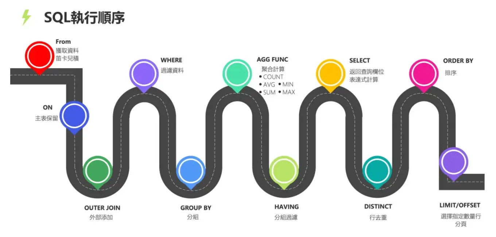

### 一. 基础点

#### 1. ACID vs BASE

**ACID** 是**事务四大特性**, 是MySQL, Oracle, PostgreSQL等*关系型数据库*的核心标准

1. A - Atomic 原子性: 事务是不可分割的最小单元, 要么全成功, 要么全失败回滚
2. C - Consistency 一致性: ACID的最终目标
3. I - Isolation 隔离性: 多个并发事务之间相互隔离, 互不干扰, 避免长度, 不可重复读, 幻读
4. D - Durability 持久性: 事务提交成功后, 修改永久落地磁盘

ACID 适合于 金融, 支付, 订单, 库存扣等要求**强一致**的业务, 容忍性能牺牲

**BASE** 是 Redis 相关

#### 2. 数据库三大范式

范式是**表结构设计规范**, 目的是减少数据冗余, 避免增删改异常; 范式越高冗余越少, 但是多表关联会变多

- 主属性: 候选键 (能当主键的字段集合) 里的字段;
- 非主属性: 不在候选键中的字段
- 函数依赖: 如果给定 X 的值, 就能唯一确定 Y 的值, 就成 Y 函数依赖于 X

**三大范式:**

1. 1NF : 数据表中**每一列的值必须是不可拆分的原子值**，不能是集合、数组、多个数据拼接
2. 2NF: 所有**非主属性必须完全依赖整个主键**，不能只依赖主键的一部分（消除部分依赖）。
   1. 每一列都和整个主键相关, 而不能至于主键的某一部分相关 (即不能"主键的其他部分不能决定该列值")
3. 3NF: **非主属性不能依赖其他非主属性**，只能直接依赖主键，消除传递依赖。
   1. 每一列数据都和主键直接相关, 而不能间接相关

#### 3. 外键约束

外键约束是为了维护表与表之间的关系, **确保数据的完整性和一致性, **若没有外键约束, 一个表的情况更新可能不会同步到另一个表.

#### 4. 常见的函数

##### 字符串函数

- `CONCAT(str1, str2, ...)`
- `LENGTH(str)`: 返回字符数
- `SUBSTRING(str, pos, len)`: 从指定位置开始, 截取指定长度的子串
- `REPLACE(str, from_str, to_str`: 将字符串中的某部分替换为另一个字符串

##### 数值函数

- `ABS(num)`
- `POWER(num, exponent)`: 返回指定数字的指定幂次方

##### 日期和时间函数

- `NOW()`: 当前日期 + 时间
- `CURDATE()`: 仅日期

##### 聚合函数

- `COUNT(column)`: 指定列非NULL值的个数
- `SUM(column/条件表达式)`
- `AVG(column)`
- `MAX(column)/MIN(column)`

- **`EXIST(子查询)`: ** 返回布尔值
  - 子查询能查出至少 1 条记录 -> 返回`true`
  - 一条都查不到 -> 返回`false`
  - 子查询经常用 `SELECT 1`, 是性能最优，行业规范
- `IN(子查询)`: 返回布尔值, `IN`前面的字段是否属于后面子查询的某行数据

#### 5. 外键约束

外键约束的作用是维护表与表之间的关系, **确保数据的完整性和一致性. ** 比如: 如果没有约束外键, 可能出现改表的一行数据对象已经删除了, 但是外键关联的那张表还是有指向该对象的外键值.

#### 6. SQL 查询语句的执行顺序



### 二. 题目

#### MySQL如何避免重复插入数据

1. 使用 UNIQUE 对字段约束

2. **插入和更新结合**使用 `INSERT ... ON DUPLICATE KEY UPDATE`

   ```SQL
   INSERT INTO users (email, name)
   VALUES ('example@example.com', 'John Doe')
   ON DUPLICATE KEY UPDATE name = VALUES(name);
   ```

   email和name中要有一个用主键/UNIQUE约束, 当插入出现重复键时就会触发**唯一键冲突 (duplicate key)** , 此时会执行后面的update逻辑

3. 快速忽略重复插入
   ```SQL
   INSERT IGNORE IINTO users(email, name)
   VALUES('example@example.com', 'John, Doe');
   ```

#### Text数据类型可以无限大吗？

MySQL的 三种text类型的最大长度:

- TEXT: 65,535 bytes / 65Kb
- MEDIUMTEXT: 16,777,215 bytes / 16Mb
- LONGTEXT: 4,284,967,295 bytes / 4Gb

#### 讲一讲 MySQL 的引擎吧, 你有什么了解?

- **InnoDB**：MySQL 的**默认存储引擎**。它是为处理大量短期事务而设计的**事务型引擎**，也是目前最重要、使用最广泛的引擎。
  - **核心特性**：支持 ACID 事务、**行级锁**以提高并发性能、支持**外键约束**，并具备崩溃恢复能力。
  - **适用场景**：对数据一致性、完整性要求高，且需要**高并发**读写的系统。
- **MyISAM**：MySQL 5.5 版本之前的**默认引擎**，以**速度快**著称。
  - **核心特性**：**不支持事务和外键**，使用**表级锁**，在高并发读写场景下性能受限。占用磁盘空间相对较小。
  - **适用场景**：以**读操作和插入操作**为主，对事务完整性要求不高的应用，如数据仓库、日志或报表系统。
- **Memory (HEAP)**：将所有数据存储在**内存**中，以追求极致的访问速度。
  - **核心特性**：**不支持事务**，重启或崩溃后数据会丢失。表级锁限制了并发写入性能。
  - **适用场景**：存储临时数据、缓存数据或会话信息等**非关键性数据**的快速查找场景。

#### 说一下 MySQL 的 InnoDB 与 MyISAM 的区别

1. **事务**: InnoDB 支持事务, MyISAM不支持事务;
2. **索引结构**: InnoDB是局促索引, MyISAM是非聚簇索引, **聚簇索引的文件**存放在主键索引的叶子节点上, 因此 InnoDB必须要有主键, 通过主键查询效率很高; 二级索引的叶子节点存储的主键, 所以主键不应该过大, 以保证二次查询的效率不会太低;  MyISAM 是非聚簇索引, 数据文件是分离, 索引保存的是数据文件的指针.
3. **锁粒度**: InnoDB最小的锁粒度是行锁, MyISAM最小的锁粒度是表锁, 一个更新锁住整张表, 导致其他查询和更新都会被阻塞, 因此并发访问受限
4. **count的效率**: InnoDB不保存表的具体函数, 而MyISAN用一个变量保存了整个表的函数, 执行`count(*)`时只需要独处该变量即可, 速度很快
