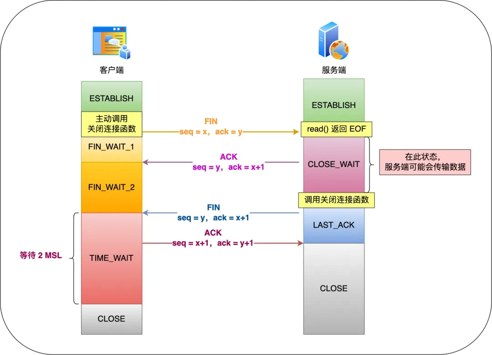
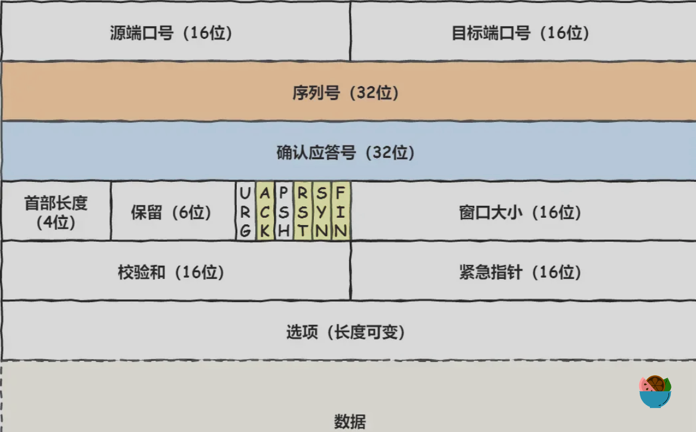

### 一. 基础点

##### 1. TCP 四次握手

##### 2. 路由的概念
计算机网络中的路由是以**网络** (子网) 为单位进行的, 这样做的目的是使得**路由信息传输, 计算和匹配的代价低**

- "到了这个路由器, 就是到了这个网络"

### 二. 针对题目

#### 说一下 TCP 的头部

报文头部的状态位: 

- ACK: 改位为1是, 表示*确认应答号*有效
- RST: 该位为 1 时, 表示TCP连接中出现异常必须强制断开连接
- SYN: 该位为 1 时, 表示希望建立连接
- FIN: 该位为 1 时, 表示今后不会再有数据发送, 希望断开连接. 当通信结束希望断开连接时, 通信双方的主机之间可以互相交换 FIN 位位位为1的TCP段(四次握手)