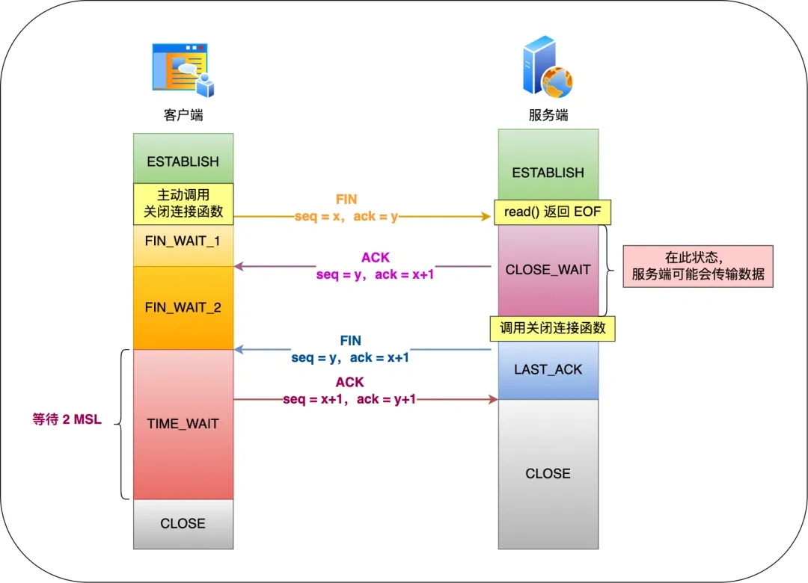
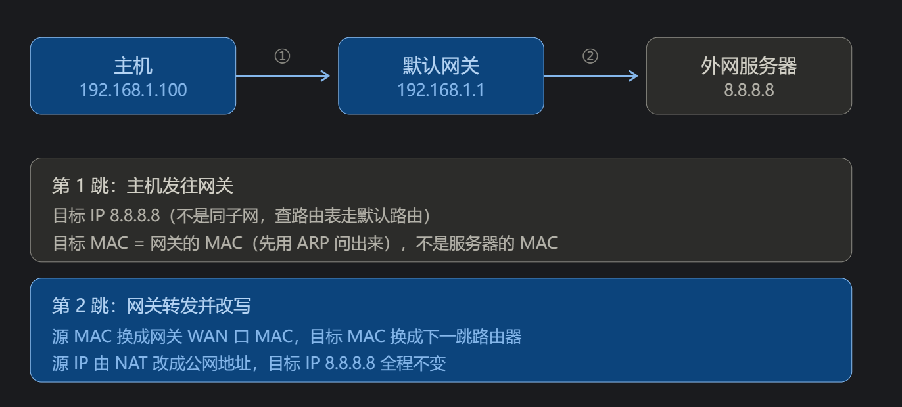
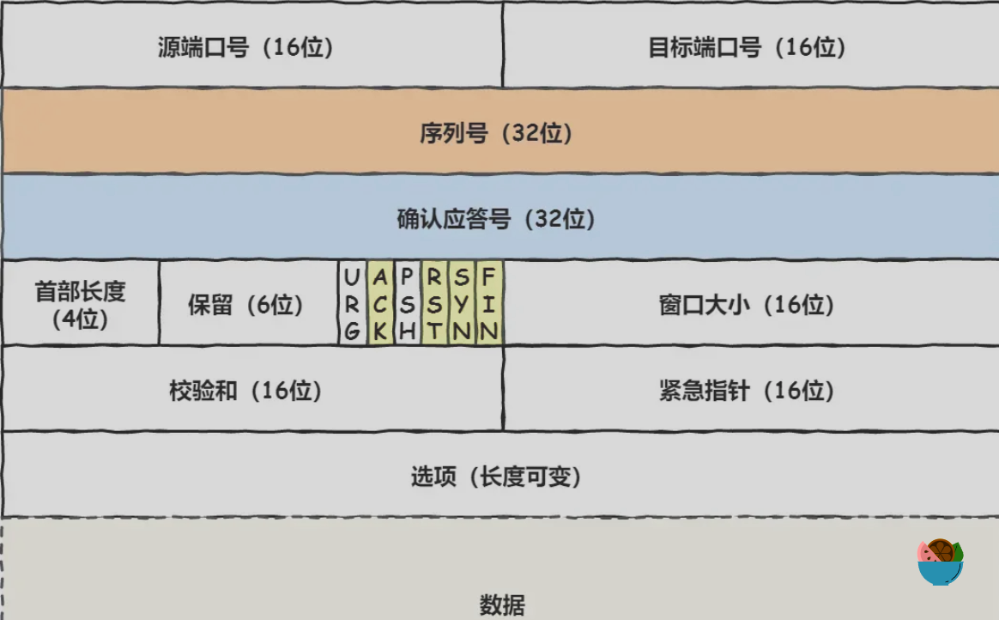

## 一. 基础点

### 1. TCP 四次握手

这里主动调用的**关闭连接函数**通常是指`shutdown()`函数

### 2. 路由的概念
计算机网络中的路由是以**网络** (子网) 为单位进行的, 这样做的目的是使得**路由信息传输, 计算和匹配的代价低**

- "到了这个路由器, 就是到了这个网络"

### 3. 什么是"网关(gateway)"

网关不是一个"位于某一层的设备"，而是一个**角色**：只要一个节点站在两个网络的边界上，并且做了"转发 + 转换/管控"，它就叫网关。**它在哪一层干活，就是那一层的网关。** RFC 的官方口径：

> RFC 1392《Internet Users' Glossary》原文： **“a router is a layer 3 (network layer) gateway, and a mail gateway is a layer 7 (application layer) gateway.”** 
> ——路由器是三层网关，邮件网关是七层网关，两者都叫 gateway。

**几个主要的网关形态**:

1. **应用层:** API 网关/邮件网关等 - 语义级协议转换;
2. **传输层:** NAT/PAT - 端口改写 连接终结
3. **网络层:** 路由器, **默认网关**, NAT网关 - 路由与地址转换

**越往上层走，"转换"的语义越重**：

- **L3** 基本只做转发和地址改写（NAT 改 IP），不碰内容
- **L4** 开始终结连接、改写端口（PAT）、卸载 TLS
- **L7** 完全理解应用语义，能改请求、做鉴权、限流、聚合——API 网关就在这一层

软件行业的各种网关 "API Gateway、Spring Cloud Gateway、支付网关、IoT 网关——它们和网络设备毫无关系，借的是"**统一入口 + 中介 + 转换**/管控"这个意象。"

网络层的**默认网关**大致流程:

**主机发给网关时，以太帧的目标 MAC 是网关的 MAC，但 IP 包的目标 IP 始终是真正的服务器**。IP 负责"最终去哪"，MAC 负责"这一跳交给谁"——每经过一跳路由器，MAC 都被重写一次，而 IP 端到端不变（除非有 NAT）。

#### NAT 网关 详解

NAT 大致描述为一件事:

> 一个数据包穿过 NAT网关时, IP 头和TCP头里的地址/端口字段被重写了, 而网关把"改前<->改后"记在一张表("有状态")里, 回程时再改回来.

**为什么会有出现NAT网关**

1994 年 RFC 1631 提出 NAT，1996 年 RFC 1918 **划出三段私网地址（`10.0.0.0/8`、`172.16.0.0/12`、`192.168.0.0/16`）**。自此一个公网 IP 可以被成百上千台机器复用——互联网本该在 2011 年前后耗尽 IPv4，是 NAT 把它续命到了今天。

NAT 大致描述为一件事:

> 一个数据包穿过 NAT网关时, IP 头和TCP头里的地址/端口字段被重写了, 而网关把"改前<->改后"记在一张表("有状态")里, 回程时再改回来.

网关内部维护的转换表：

| 内部本地         | 内部全局            | 外部地址            | 协议 |
| ---------------- | ------------------- | ------------------- | ---- |
| `10.0.0.7:50000` | `203.0.113.5:60001` | `93.184.216.34:443` | TCP  |

## 二. 针对题目

### 1. 说一下 TCP 的头部

报文头部的状态位: 

- ACK: 改位为1是, 表示*确认应答号*有效
- RST: 该位为 1 时, 表示TCP连接中出现异常必须强制断开连接
- SYN: 该位为 1 时, 表示希望建立连接
- FIN: 该位为 1 时, 表示今后不会再有数据发送, 希望断开连接. 当通信结束希望断开连接时, 通信双方的主机之间可以互相交换 FIN 位位位为1的TCP段(四次握手)

### 2. 为什么四次挥手之后要等到2MSL

MSL(Maximum Segment Lifetime)是数据报文在互连网中存活的最大时间, Linux通常为30秒, windows为2分钟. 之所以要等到2MSL, 是为了覆盖:
1. 一个MSL: 让旧链接的最后一个ACK从主动关闭方到达被动方(可靠性)
2. 一个MSL: 当被动关闭方如果超时重传的FIN也能走完最长的往返路径(防污染)

这个就能确保旧连接所有报文(包括重传的)都在网络中消亡从而保证新链接不会受到旧连接的残留数据.