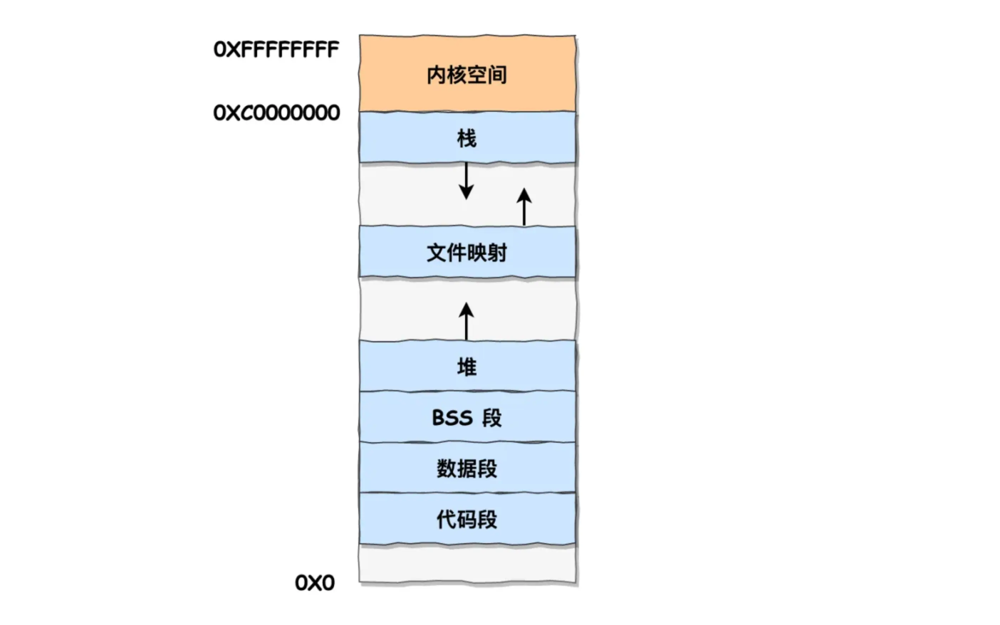

# 🖥️ 操作系统笔记

> 个人笔记，按需补充。

## 一. 基础点

### 1. 内存管理 - OS设计的虚拟内存有什么好处

- 第一，**虚拟内存可以使得进程的运行内存超过物理内存大小**，因为程序运行符合局部性原理，**CPU访问内存会有很明显的重复访问的倾向性**，对于那些没有被经常使用到的内存，我们可以把它换出到物理内存之外，比如硬盘上的swap区域。
- 第二，由于每个进程都有自己的页表，**所以每个进程的虚拟内存空间就是相互独立的**。进程也没有办法访问其他进程的页表，所以这些页表是私有的，这就解决了多进程之间地址冲突的问题。
- 第三，页表(PT)里的页表项(PTE)中除了物理地址之外，还有一些标记属性的比特，比如控制一个页的读写权限，标记该页是否存在等。在内存访问方面，**操作系统提供了更好的安全性**。

### 2. 内存管理 - 内存分段机制? 段表?

#### 分段和段表

分段的核心思想是: **将一个程序按照逻辑功能划分成不同的"段"(Segment), ** 每个段都代表程序中的一个逻辑模块, 并且拥有不同的用途和属性, 常见的段包括:

- **代码段**：存放程序的执行指令。
- **数据段**：存放程序中的全局变量和静态变量。
- **堆段（Heap）**：用于程序动态申请的内存空间。
- **栈段（Stack）**：用于保存函数调用时的局部变量和返回地址。

每个段在段表中有一个项, 在这一项根据段号找到段的基地址, 再加上逻辑地址的偏移量, 于是就能找到物理内存中的地址.

#### 分页 vs 分段

如果说分页是操作系统为了方便管理内存而进行的“物理”划分，那么分段就是为方便程序员而进行的“逻辑”划分。

| 对比维度         | **分段 (Segmentation)**                                      | **分页 (Paging)**                                           |
| :--------------- | :----------------------------------------------------------- | :---------------------------------------------------------- |
| **划分依据**     | **逻辑划分**，根据程序的自然结构（如代码、数据、栈）。       | **物理划分**，由系统强制将内存划分为固定大小的块（如4KB）。 |
| **对用户可见性** | **可见**，程序员和编译器可以感知到段的存在。                 | **透明**，对程序员和编译器是完全透明的。                    |
| **地址空间**     | **二维的**，地址由 `段号 + 段内偏移` 组成。                  | **一维的**，地址是一个单一的线性地址。                      |
| **大小**         | **动态可变**，每个段的大小由其逻辑功能决定。                 | **固定不变**，所有页面的大小都一样。                        |
| **主要问题**     | **外部碎片**，因为段的大小不一，内存分配久了会产生难以利用的小空隙。 | **内部碎片**，最后一个页面可能用不满，造成少量浪费。        |

现代操作系统通常**将两者结合, 采用段页式管理, 既保留了分段的逻辑性, 又利用了分页的高效性**

### 3. 进程管理 - 进程的基本描述

**进程 = 程序的一次执行过程，是操作系统进行资源分配的基本单位。** 它与"程序"不同：程序是**静态的**（磁盘上的代码文件，没有生命），进程是**动态的**（程序被加载进内存、有状态、正在运行）。同一个程序可被运行多次，产生多个进程。

#### 进程的内存组成

用户地址空间（**各进程独立**）+ 内核区 **PCB**（进程控制块，操作系统"认识"进程的唯一凭据）。

**用户地址空间**：

- **代码段（text）**：只读指令
- **数据段（data/bss）**：全局/静态变量
- **堆（heap）**：动态分配，`malloc`，向上增长
- **栈（stack）**：函数调用局部变量，向下增长

**内核区 PCB**：记录进程全部信息，无 PCB 则内核不知进程存在。

#### PCB（进程控制块）记录的内容

| 类别      | 记录内容                                                     |
| --------- | ------------------------------------------------------------ |
| 标识符    | PID（进程号）、父进程 PID（PPID）                            |
| 状态/调度 | 当前状态（**就绪/运行/等待**）、优先级、调度参数             |
| CPU 现场  | PC（下一条指令）、SP（栈指针）、通用寄存器 —— 即"上下文"要保存的东西 |
| 内存信息  | 页表指针 / 基址和长度（描述地址空间在哪）                    |
| 资源信息  | 打开的文件表、占用设备、信号、I/O 状态                       |

#### 进程的特点

1. **动态性**：有生命周期（创建→运行→终止）
2. **并发性**：多个进程可同时推进，**宏观并行/微观轮转**
3. **独立性**：各自独立地址空间和资源，进程间不互相干扰
4. **异步性**：进程按各自不可预知的速度推进，需要同步机制

PCB 是支撑这一切的"身份证+档案"，也是 OS 调度、切换、回收的依据。

#### 进程的三种基本状态

- **就绪态（Ready）**：已准备好，只差 CPU，等**调度器**选中。
- **运行态（Running）**：正占用 CPU，指令正在执行。
- **阻塞态（Blocked/Waiting）**：主动放弃 CPU 在等某个条件（磁盘 IO、输入、锁）。

外加两个辅助状态：**创建态**（资源正在分配）、**终止态**（进程结束，资源正在回收，僵尸进程在此）。

#### 状态转换图与触发事件

| 转换      | 触发事件                      | PCB 里的变化     | 上下文/地址空间细节                                          |
| --------- | ----------------------------- | ---------------- | ------------------------------------------------------------ |
| 就绪→运行 | 调度器选中（分配 CPU）        | 状态字段改"运行" | 从 PCB 恢复 **CPU 现场（PC/SP/寄存器）**，页表基址加载到 CR3 |
| 运行→就绪 | 时间片用完 / 被抢占           | 状态字段改"就绪" | 保存现场回 PCB，进程回就绪队列排队                           |
| 运行→阻塞 | 发起系统调用（等 IO/锁/输入） | 状态字段改"阻塞" | 保存现场回 PCB，移出就绪队列，进等待队列，CPU 让出           |
| 阻塞→就绪 | 事件完成（IO 中断、锁释放）   | 状态字段改"就绪" | 进程被唤醒，插回就绪队列；不能直达运行                       |

**三条硬规则**：

1. 阻塞→就绪→运行，阻塞进程不能"一步到位"直达运行。
2. 运行→就绪（被剥夺 CPU）或 运行→阻塞（自己让出 CPU 等）。
3. 就绪进程一旦被调度，一定进入"运行"。

## 二. 针对题目

### 1. 进程和线程的区别是什么?
- **本质区别:** 进程是资源分配的基本单位, 线程是**CPU调度的基本单位**

- **开销方面:**

  - 每个进程都有独立的代码和数据空间(程序上下文), 进程之间的切换会由较大的开销(需要切换维护PCB和CPU运行线程); 
  - 线程可以当做轻量级的进程, 同一类线程共享代码和数据空间, **每个线程都有自己独立的运行栈和程序计数器, 线程之间切换的开销小**

- **稳定性方面:** 进程中某个线程如果崩溃, 可能会导致整个进程都崩溃; 而进程中的子进程崩溃, 并不会影响其他进程

- **内存分配方面:** 系统在运行的时候会为每个进程分配不同的内存空间;  而对线程而言, 除了CPU以外, 系统不会为线程分配内存 (线程所使用的资源来自其所属进程的资源) , 线程组之间只能共享资源)

- **包含关系: **没有线程的进程可以看作是单线程的, 如果一个进程内有多个线程, 则执行过程不是一条线, 而是多条线

  
  
- **进程线程的职责分工:**

  |      | 进程（资源分配单位）            | 线程（CPU 调度单位）                       |
  | ---- | ------------------------------- | ------------------------------------------ |
  | 拥有 | 完整地址空间、文件表、信号      | 只有私有的寄存器、栈、程序计数器           |
  | 共享 | —                               | **同进程所有线程共享进程的地址空间和数据** |
  | 开销 | 创建/切换贵（要复制地址空间）   | 创建/切换便宜（不用换地址空间）            |
  | 隔离 | 强（进程间地址空间隔离）        | 弱（线程共享数据，需同步）                 |
  | 通信 | 进程间靠 IPC（管道/共享内存等） | 线程间直接读写共享变量即可                 |

#### 简单说一下协程

- 协程是一种用户态的轻量级线程, 其调度完全有用户程序控制, 而不需要内核的参与
- 协程拥有自己的寄存器上下文和栈, 但与其他协程共享堆内存, 协程切换的开销小, 不陷入内核;
- 协程需要程序员显示的进行调度和管理

### 2. 用户态和内核态的区别

用户态和内核态是操作系统中的两种运行模式, 他们的主要区别在于**权限和可执行的操作**:

- **用户态(User Mode):** 在用户态下, CPU只能执行部分指令集, 无法直接访问硬件资源. 这种模式下的操作权限较低, **主要用于运行用户程序**
- **内核态(Kernel Mode):** 在内核态下，**CPU可以执行所有的指令和访问所有的硬件资源**, 这种模式下的操作具有很高的权限, 主要用于**操作系统内核的运行**.
  - 内核态的底层操作主要包括: **内存管理, 进程管理**, 设备驱动程序控制, **系统调用**等, 这些操作涉及到操作系统的核心功能, 需要较高的权限来执行

区分内核态和用户态原因:

1. **安全性**：通过对权限的划分，用户程序无法直接访问硬件资源，从而避免了恶意程序对系统资源的破坏。
2. **稳定性**：用户态程序出现问题时，不会影响到整个系统，避免了程序故障导致系统崩溃的风险。
3. **隔离性**：内核态和用户态的划分使得操作系统内核与用户程序之间有了明确的边界，有利于系统的模块化和维护。

### 3. 进程是资源分配的基本单位, 这里的"资源"是指?

虚拟内存, 文件句柄, 信号量等资源

### 4. 多线程比单线程的优势, 劣势?

### 5. 程序的内存布局是什么样的?

**用户空间内存, 从低到高分别是6种不同的内存段: **

- **代码段**, 包括二进制可执行代码
- **数据段**, 包括已初始化的静态常量和全局变量;
- **BSS**, 包括未初始化的静态变量和全局变量
- **堆段**: **包括动态分配的内存, 从低地址开始向上增长**
- **文件映射段**: 包括动态库, 共享内存
- **栈段**: **包括局部变量和函数调用的上下文**, 栈的大小是固定的, 一般是 8MB
